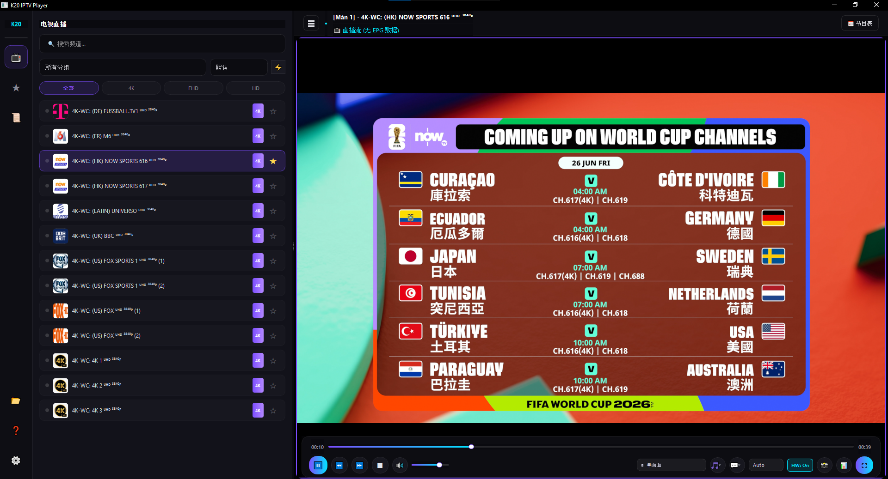
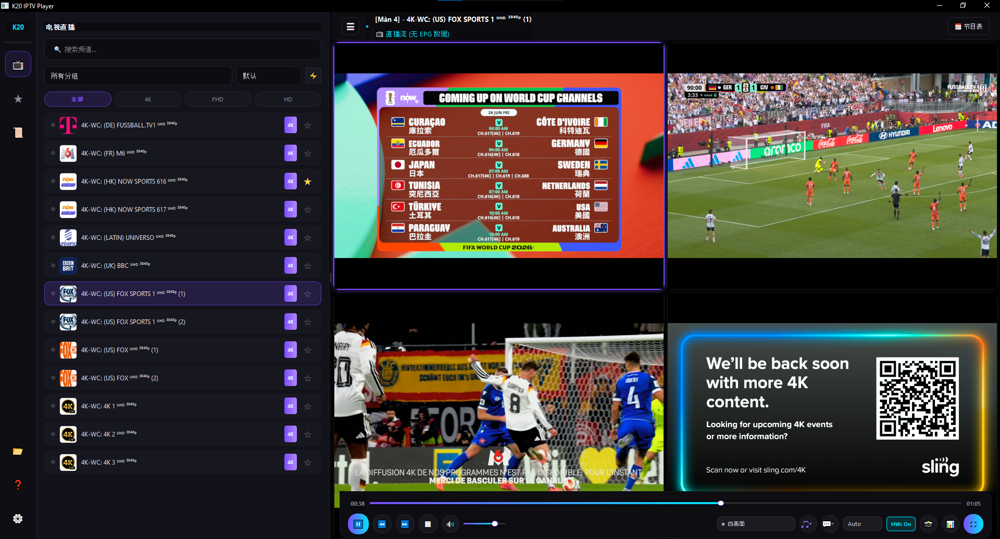
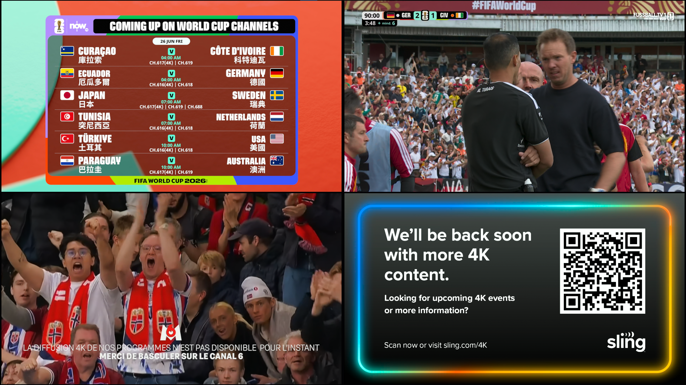

<div align="center">

# 📺 K20 IPTV Player

**A modern, high-performance desktop IPTV player built with Python + PySide6 + MPV**

*Entire codebase vibe-coded with [Antigravity](https://antigravity.dev) — Google DeepMind's AI coding assistant*

[](https://python.org)
[](https://doc.qt.io/qtforpython/)
[](https://mpv.io)
[](LICENSE)
[](https://antigravity.dev)

</div>

---

## ✨ About This Project

K20 IPTV Player is a **fully-featured, open-source IPTV client** for Windows desktop. It supports live TV streaming via M3U playlists and Xtream Codes API, with a sleek dark glassmorphism UI and hardware-accelerated playback.

> 💡 **This entire project was built using [Antigravity](https://antigravity.dev)** — an AI coding assistant by Google DeepMind. From the initial architecture to every feature, bug fix, and localization pass — all code was vibe-coded with AI assistance. A testament to what modern AI-assisted development can achieve.

---

## 📸 Screenshots

### 🖥️ Single Screen Mode — 4K Live TV

*Watching a 4K FIFA World Cup channel in single-screen mode. Dark glassmorphism UI with channel list, category filters (4K / FHD / HD), and live channel status badges.*

---

### ⊞ Quad View — 4 Channels Simultaneously

*Quad-view (2×2) layout streaming 4 different 4K sports channels at the same time — all hardware-accelerated.*

---

### 🎬 Quad View Content — Close-up

*Four-panel view: NOW Sports 4K, Fussball.TV UHD, a live football match, and a 4K sports channel — all playing simultaneously with zero frame drops.*

---


## 🚀 Features

### 🎬 Playback
- **Hardware-accelerated video** via libmpv (D3D11VA / DXVA2 on Windows)
- Smooth **4K / 50fps** streaming without lag or frame drops
- **Multi-screen layout**: 1×1 single view or 2×2 quad view
- Live stream **auto-reconnect** on connection loss (up to 3 retries)
- **Picture-in-Picture (PiP)** mode
- Live **recording** of active stream to disk
- Screenshot capture (F12 / S key)

### 📋 Playlist Management
- **M3U file** support (local files)
- **M3U URL** support (remote playlists with auto-refresh)
- **Xtream Codes API** integration (full category + channel loading via JSON API)
- Multi-playlist manager with Add / Edit / Delete support

### 🗂️ Channel Management
- **Auto-grouping** by category (Sports, Movies, News, 4K, etc.)
- **Smart search** with real-time filtering
- **Sort** by Default / A-Z / Low Latency
- **Favorites** system with ⭐ star toggle on each channel item
- **Watch history** tracking

### 📅 EPG (Electronic Program Guide)
- XMLTV EPG schedule panel
- Live "Now Playing" info display
- Auto-sync with Xtream Codes `xmltv.php` endpoint

### 🌐 Multilingual UI
- **Tiếng Việt (VI)** — Vietnamese
- **English (EN)**
- **简体中文 (CN)** — Simplified Chinese
- Instant language switching from Settings — no restart required

### ⚙️ Settings & Customization
- **Buffer size presets**: 10 MB → 500 MB (5 levels for mobile to 4K networks)
- **Hardware decoding** toggle (D3D11VA)
- **Sleep timer**: auto-shutdown after 15 / 30 / 45 / 60 / 90 / 120 minutes
- Live **stream stats OSD**: resolution, FPS, codec, bitrate, net speed, decoder, buffer

### ⌨️ Keyboard Shortcuts
| Key | Action |
|-----|--------|
| `Space` | Play / Pause |
| `F` / Double Click | Toggle Fullscreen |
| `M` | Mute / Unmute |
| `I` | Toggle Stream Stats OSD |
| `S` / `F12` | Screenshot |
| `P` | Picture-in-Picture |
| `R` | Toggle Recording |
| `F5` | Reload Stream |
| `↑ ↓` | Volume ±5% |
| `← →` | Seek ±5s |
| `H` | Toggle Shortcuts HUD |
| `Esc` | Exit Fullscreen |

---

## 🛠️ Tech Stack

| Component | Technology |
|-----------|------------|
| Language | Python 3.10+ |
| GUI Framework | PySide6 (Qt 6) |
| Player Core | `python-mpv` + libmpv |
| Data Storage | JSON config |
| EPG | XMLTV parsing |
| Networking | `requests` |

---

## 📦 Installation

### Prerequisites
- Python 3.10+
- Windows 10/11 (64-bit)
- GPU with D3D11 support (for hardware acceleration)

### Setup

```bash
# Clone the repository
git clone https://github.com/thepersonlovecat/pc-iptv.git
cd pc-iptv

# Create virtual environment
python -m venv venv
venv\Scripts\activate

# Install dependencies
pip install PySide6 requests python-mpv

# Download libmpv DLL (required for video playback)
python download_mpv_dll.py

# Run the player
python main.py
```

### Dependencies

```
PySide6>=6.5.0
requests>=2.28.0
python-mpv>=1.0.0
```

---

## ⚙️ Configuration

On first launch, a `config.json` file is created automatically with sensible defaults.

**To add a playlist:**
1. Click the **playlist icon** (📁) in the sidebar
2. Choose **Add File**, **Add URL**, or **Add Xtream Codes**
3. Enter your M3U link or Xtream Codes credentials

> ⚠️ `config.json` is excluded from the repository (listed in `.gitignore`) as it may contain personal playlist URLs or Xtream Codes credentials.

---

## 🗂️ Project Structure

```
pc-iptv/
├── main.py              # Main application (UI, player logic, localization)
├── config_manager.py    # Config load/save helpers
├── m3u_parser.py        # M3U playlist parser
├── epg_manager.py       # XMLTV EPG parser and manager
├── download_mpv_dll.py  # Helper to download libmpv DLLs
├── .gitignore
└── README.md
```

---

## 🤖 Built with Antigravity

> This project is a showcase of **AI-assisted vibe coding** using [Antigravity](https://antigravity.dev) by Google DeepMind.
>
> Every component — from the dark glassmorphism UI to the Xtream Codes API integration, multilingual localization system, hardware-accelerated MPV backend, auto-reconnect logic, EPG panel, and the full playlist manager — was designed, written, debugged, and refined through natural-language conversation with Antigravity.
>
> No boilerplate generators were used. No copy-paste from StackOverflow. Just a developer describing what they want, and an AI building it — iteratively, cleanly, and completely.

---

## 📄 License

MIT License — see [LICENSE](LICENSE) for details.

---

<div align="center">

Made with ❤️ and [Antigravity](https://antigravity.dev) · Star ⭐ this repo if you find it useful!

</div>
